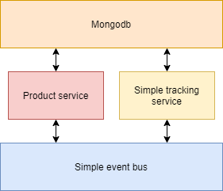
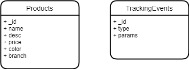
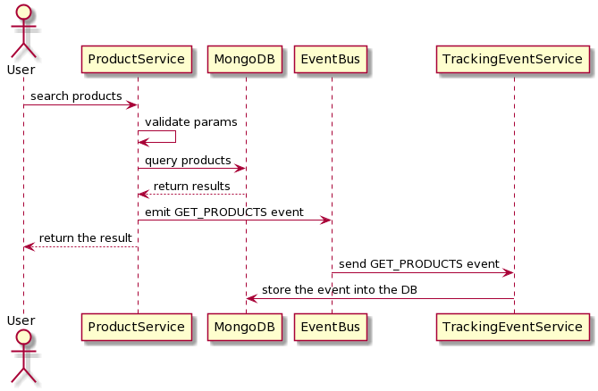

# ICommerce project
## Features
- Searching for products 
- Tracking events

## Architecture


- Mongo DB
- Product service: Taking responsibility for searching products. Emitting events to the event bus when the product search a product
- Simple tracking service: Receive events from the event bus and store event data into the DB
- Event bus: A very simple event bus which taking responsibility for communicating between services

## DB schema


## Sequence Diagram


## Getting Started
### Installation

Set the environment variables:

```bash
cp .env.example .env

# open .env and modify the environment variables (if needed)
```

Run docker-compose
```bash
docker-compose -f docker-compose.yml -f docker-compose.dev.yml build
docker-compose -f docker-compose.yml -f docker-compose.dev.yml up
```

Import data seed
```bash
docker ps
# Get the container id of Mongo
docker exec -it [Container Id of Mongo] ./data/seeder.sh
```

## Project Structure
### Product service
```
src\
 |--config\         # Environment variables and configuration related things
 |--controllers\    # Route controllers (controller layer)
 |--docs\           # Swagger files
 |--middlewares\    # Custom express middlewares
 |--models\         # Mongoose models (data layer)
 |--routes\         # Routes
 |--services\       # Business logic (service layer)
 |--utils\          # Utility classes and functions
 |--validations\    # Request data validation schemas
 |--app.js          # Express app
 |--index.js        # App entry point
 |--Dockerfile      # Docker file
 ```

### Simple Event bus
```
 |--config.js       # Environment variables and configuration related things
 |--index.js        # App entry point and route controlers
 |--Dockerfile      # Docker file
```
### Simple Tracking event
```
 |--config.js       # Environment variables and configuration related things
 |--index.js        # App entry point and route controlers
 |--Dockerfile      # Docker file
```
## API Documentation (Swagger)

To view the list of available APIs and their specifications, run the server and go to `http://localhost:3000/v1/docs` in your browser.
### API Endpoints

List of available routes:

**Product routes**:\
`GET /v1/products` - search a products\
`GET /v1/products/:id` - get a product\

Example :
```bash
curl -X GET "http://localhost:3000/v1/products?price=46&branch=B&color=blue&limit=10&page=1" -H "accept: application/json"
```
### Run unit test

Run unit test in the product service
```bash
cd ./product-service
yarn test
```

Run unit test in docker
```bash
docker-compose -f docker-compose.yml -f docker-compose.test.yml build
docker-compose -f docker-compose.yml -f docker-compose.test.yml up
```

## Error Handling

The app has a centralized error handling mechanism.

Controllers should try to catch the errors and forward them to the error handling middleware (by calling `next(error)`). For convenience, you can also wrap the controller inside the catchAsync utility wrapper, which forwards the error.

```javascript
const catchAsync = require('../utils/catchAsync');

const controller = catchAsync(async (req, res) => {
  // this error will be forwarded to the error handling middleware
  throw new Error('Something wrong happened');
});
```

The error handling middleware sends an error response, which has the following format:

```json
{
  "code": 404,
  "message": "Not found"
}
```

When running in development mode, the error response also contains the error stack.

The app has a utility ApiError class to which you can attach a response code and a message, and then throw it from anywhere (catchAsync will catch it).

For example, if you are trying to get a product from the DB who is not found, and you want to send a 404 error, the code should look something like:

```javascript
const httpStatus = require('http-status');
const ApiError = require('../utils/ApiError');
const Product = require('../models/Product');

const getProduct = async (productId) => {
  const product = await Product.findById(productId);
  if (!product) {
    throw new ApiError(httpStatus.NOT_FOUND, 'Product not found');
  }
};
```

## Validation

Request data is validated using [Joi](https://hapi.dev/family/joi/).

The validation schemas are defined in the `src/validations` directory and are used in the routes by providing them as parameters to the `validate` middleware.

```javascript
const express = require('express');
const validate = require('../../middlewares/validate');
const productValidation = require('../../validations/product.validation');
const productController = require('../../controllers/product.controller');

const router = express.Router();

router.get('/products', validate(productValidation.getProducts), productController.getProducts);
```
