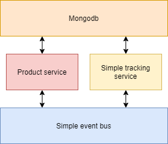
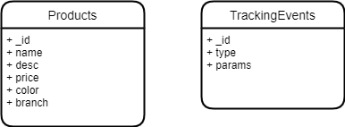
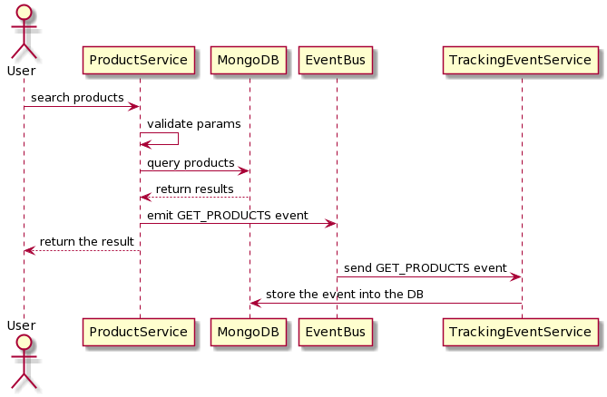

# ICommerce project
## Features
- Searching for products 
- Tracking events

## Architecture


- Mongo DB
- Product service: Taking responsibility for searching product. Emitting events to the event bus when the user search a product
- Simple tracking service: Receive events from the event bus and store event data into the DB
- Event bus: A very simple event bus which taking responsibility for communicating between services

## DB schema


## Sequence Diagram


## Getting Started
### Installation

Set the environment variables:

```bash
cp .env.example .env

# open .env and modify the environment variables (if needed)
```

Run docker-compose
```bash
docker-compose -f docker-compose.yml -f docker-compose.dev.yml build
docker-compose -f docker-compose.yml -f docker-compose.dev.yml up
```

Import data seed
```bash
docker ps
# Get the container id of Mongo
docker exec -it [Container Id of Mongo] ./data/seeder.sh
```

## Project Structure
### Product service
```
src\
 |--config\         # Environment variables and configuration related things
 |--controllers\    # Route controllers (controller layer)
 |--docs\           # Swagger files
 |--middlewares\    # Custom express middlewares
 |--models\         # Mongoose models (data layer)
 |--routes\         # Routes
 |--services\       # Business logic (service layer)
 |--utils\          # Utility classes and functions
 |--validations\    # Request data validation schemas
 |--app.js          # Express app
 |--index.js        # App entry point
 |--Dockerfile      # Docker file
 ```

### Simple Event bus
```
 |--config.js       # Environment variables and configuration related things
 |--index.js        # App entry point and route controlers
 |--Dockerfile      # Docker file
```
### Simple Tracking event
```
 |--config.js       # Environment variables and configuration related things
 |--index.js        # App entry point and route controlers
 |--Dockerfile      # Docker file
```
## API Documentation

To view the list of available APIs and their specifications, run the server and go to `http://localhost:3000/v1/docs` in your browser.
### API Endpoints

List of available routes:

**Product routes**:\
`GET /v1/products` - search a products\
`GET /v1/products/:id` - get a product\

Example :
```bash
curl -X GET "http://localhost:3000/v1/products?price=46&branch=B&color=blue&limit=10&page=1" -H "accept: application/json"
```
